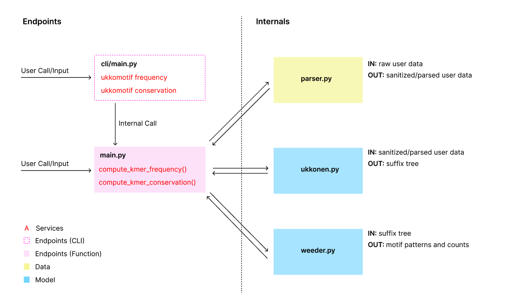

# ukkomotif

 [](https://codecov.io/gh/bpenteado/ukkomotif)

:dna: Genomic motif discovery based on Ukkonen's suffix tree implementation and .

## Why Ukkomotif

Ukkomotif is a modular toolchain for motif discovery in genomic sequences. It allows users to compute the frequency and 
conservation of kmers (motifs) of any length by providing genomic sequences together with their conservation signatures.

Motifs that are evolutionarily conserved, especially those in intergenic regions of the genome, are high-potential 
candidate sites for gene expression regulation.

Functionality is provided through a CLI and modular services (see "Core Components"). 

Ukkomotif also provides standalone services for the implementation and manipulation of suffix trees built with Ukkonen's algorithm.


## Core Components



Ukkomotif is composed of 5 main components:
- *cli/main.py*: defines command line endpoints.
- *main.py*: defines functional endpoints.
    * computer_kmer_frequency(): given a DNA sequence and a specified motif length, retrieves all motifs and their frequencies.
    * compute_kmer_conservation(): given a DNA sequence, a conservation sequence, and a specified motif length, retrieves all conserved motifs and their conservation. Conservation is defined as motif conservation frequency divided by total motif frequency.
- *parser.py*: verifies and sanitizes raw user data.
- *ukkonen.py*: builds a suffix tree based on Ukkonen's implementation.
- *weeder.py*: given a suffix tree and a substring length, implements the Weeder algorithm (finds all substrings of the specific length and computes their frequency).

## Getting Started

To begin, simply:
```
python3 -m pip install ukkomotif
```

## Inputs

Users need to provide a `dna_sequence` and a `conservation_sequence`.
- `dna_sequence`: single string with genomic sequences separated by "#". 
    * Valid characters: "ATCG-#"
- `conservation_sequence`: single string with conservation sequences separated by "#". An asterisk "*" marks a conserved nucleotide and a space " " marks a non-conserved nucleotide.
    * Valid character: " *#"
- `dna_sequence` and `conservation_sequence` need to be aligned and of same length.
- Ukkomotif verifies inputs and raises errors in case of badly formatted inputs.

## Examples

When using the CLI:
```
ukkomotif frequency "AAATGGCCGCGCCG--#AAA---TGGC----CGCGCCG#GGCTGTTGAGCGCGCGG-GA#" False 3
ukkomotif frequency path_to_file True 3

ukkomotif conservation "ATCG--#AAAT#" "   ***#  **#" False 2
ukkomotif conservation path_to_file True 2
```

When using function endpoints:
```
sample_sequence_data = "AAATGGCCGCGCCG--#AAA---TGGC----CGCGCCG#GGCTGTTGAGCGCGCGG-GA#"
sample_conservation_data = "***  *    ** ***#***            ***   #*    ***            #"
kmer_frequencies = compute_kmer_frequency(sample_sequence_data, False, 3)
kmer_conservations = compute_kmer_conservation(sample_sequence_data, sample_conservation_data, False, 3)

path_sequence_file = "tests/allinter"
path_conservation_file = "tests/allintercons"
kmer_frequencies = compute_kmer_frequency(path_sequence_file, True, 3)
kmer_conservations = compute_kmer_conservation(path_sequence_file, path_conservation_file, True, 3)
```