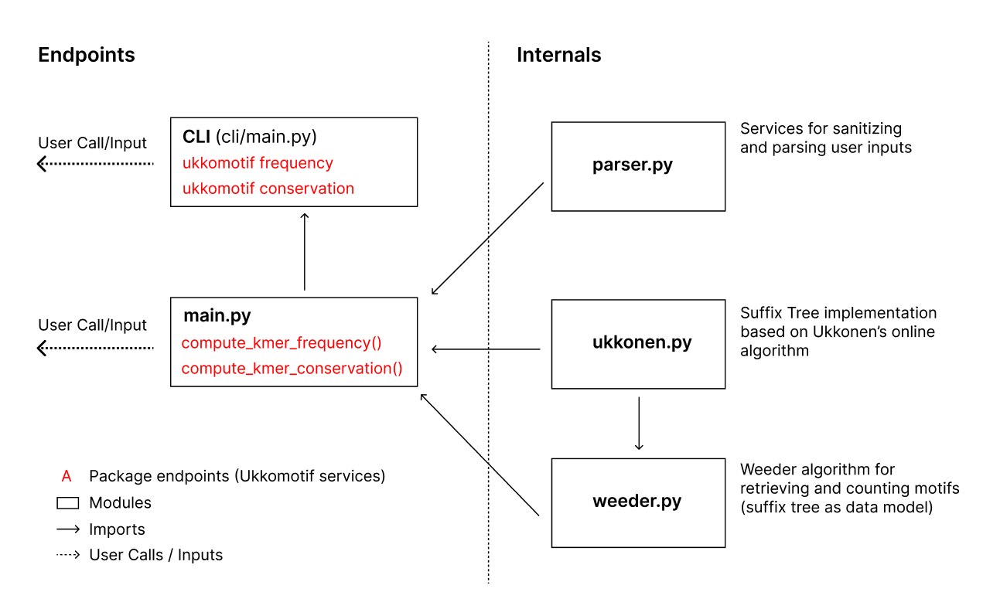

# ukkomotif

 [](https://codecov.io/gh/bpenteado/ukkomotif)

:dna: Genomic motif discovery based on Ukkonen's suffix tree implementation and the Weeder algorithm.

## Why Ukkomotif

Ukkomotif is a modular toolchain for motif discovery in genomic sequences. It allows users to compute the frequency and conservation of kmers (motifs) of any length by providing genomic sequences together with their conservation signatures.

Motifs that are evolutionarily conserved, especially those in intergenic regions of the genome, are high-potential candidate sites for gene expression regulation.

Functionality is provided through CLI and functional endpoints (see "Core Components"). 

Ukkomotif also provides standalone services for the implementation and manipulation of suffix trees built with Ukkonen's algorithm.


## Core Package Components



Ukkomotif is composed of 5 main components:
- **main.py**: defines functional endpoints.
    * **computer_kmer_frequency()**: given a DNA sequence and a specified motif length, retrieves all motifs and their frequencies.
    * **compute_kmer_conservation()**: given a DNA sequence, a conservation sequence, and a specified motif length, retrieves all conserved motifs and their conservation. Conservation is defined as motif conservation frequency divided by total motif frequency.
- **cli/main.py**: defines command line endpoints.
    * **ukkomotif frequency**: CLI endpoint for compute_kmer_frequency()
    * **ukkomotif conservation**: CLI endpoint for compute_kmer_conservation()
- **parser.py**: verifies and sanitizes raw user data.
- **ukkonen.py**: suffix tree implementation based on Ukkonen's online algorithm.
- **weeder.py**: Wedder algorithm implementation. Given a suffix tree and a substring length, finds all substrings of the specific length and computes their frequency.

## Getting Started

To begin, simply:
```
python3 -m pip install ukkomotif
```

## Data Inputs

Users need to provide a `dna_sequence` and a `conservation_sequence`.
- `dna_sequence`: single string with genomic sequences separated by "#". 
    * Valid characters: "ATCG-#"
- `conservation_sequence`: single string with conservation sequences separated by "#". An asterisk "*" marks a conserved nucleotide and a space " " marks a non-conserved nucleotide.
    * Valid character: " *#"
- `dna_sequence` and `conservation_sequence` need to be aligned and of same length.
- Ukkomotif verifies inputs and raises errors in case of badly formatted inputs.

## Usage

When calculating motif frequencies using the CLI, where PATH is a path to the DNA file:
```console
$ ukkomotif frequency "AAATGGCCGCGCCG--#AAA---TGGC----CGCGCCG#GGCTGTTGAGCGCGCGG-GA#" 0 3 --list 5
CGC 6
GCG 5
GCC 4
CCG 4
GGC 3
$ ukkomotif frequency PATH 1 4 --list 3
AAAA 70931
TTTT 69711
ATAT 42771
```

When calculating motif conservations using the CLI, where `PATH1` is a path to the DNA file and `PATH2` is a path to the conservation file:
```console
$ ukkomotif conservation "ATCG--#AAAT#" " ** **# ***#" 0 2 --list 3
TACCCG 0.
AA 0.5
AT 0.5
$ ukkomotif conservation PATH1 PATH2 1 6 --list 5
TACCCG 0.4327731092436975
CGGGTA 0.43243243243243246
CCGGGT 0.38524590163934425
ACCCGG 0.36860068259385664
CACGTG 0.3489010989010989
```

When calculating motif frequencies and conservations using the functional endpoints:
```python
# using raw data
sample_sequence_data = "AAATGGCCGCGCCG--#AAA---TGGC----CGCGCCG#GGCTGTTGAGCGCGCGG-GA#"
sample_conservation_data = "***  *    ** ***#***            ***   #*    ***            #"
kmer_frequencies = compute_kmer_frequency(sample_sequence_data, False, 3)
kmer_conservations = compute_kmer_conservation(sample_sequence_data, sample_conservation_data, False, 3)

# using data in files
path_sequence_file = "tests/allinter"
path_conservation_file = "tests/allintercons"
kmer_frequencies = compute_kmer_frequency(path_sequence_file, True, 3)
kmer_conservations = compute_kmer_conservation(path_sequence_file, path_conservation_file, True, 3)
```